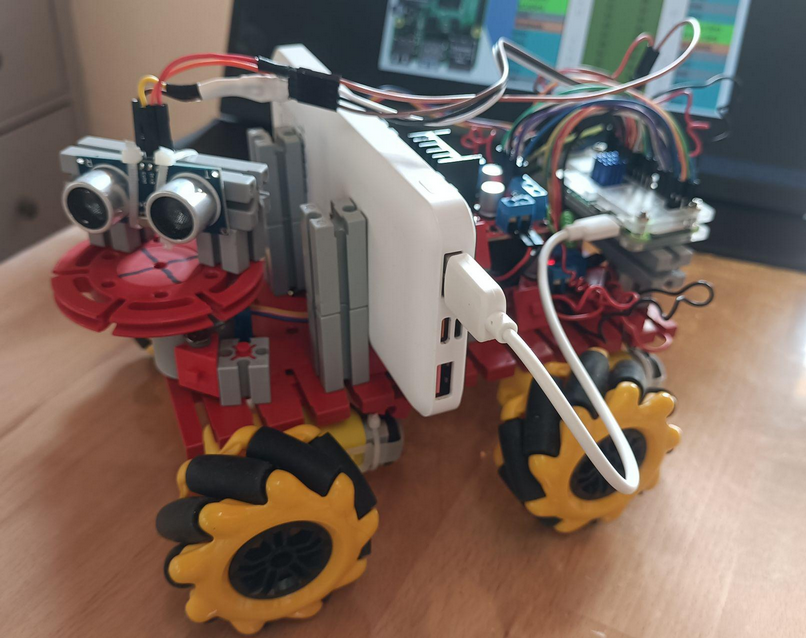

# Rover Control with Python

## A learning project for object-oriented programming in Python

This project addresses pupils of nineth to tenth grade.

### Objective

Control a simple rover built from basic Fischer Technik parts, cheap mechanical
and electronic components with a Raspberry Pi Zero2 and Python programming language. 
 

A 4WD rover with sonar distance sensor 

### Project Concepts
When developing a control program—for example, for a model vehicle—you quickly 
run into the idea of objects. Motors, sensors, actuators, and many other components 
naturally suggest themselves. Python provides language features that make it easy 
to represent such real-world elements as objects or classes within a program.

For instance, we might define a Motor class with methods to control its 
rotation direction and speed. In the same way, we could create classes for an 
ultrasonic distance sensor or a stepper motor.

But software objects don’t always have to map directly to a single physical component. 
Often, they serve higher-level tasks, such as coordination and control. 
A Sonar class, for example, could combine the functionality of a stepper motor and a 
distance sensor to scan the environment. Similarly, steering can be implemented as an object 
that coordinates multiple motors working together.

Controlling even a simple vehicle comes with a number of challenges. 
At the same time, there also needs to be a way for the user to operate it. 
Python again offers powerful tools for this—for example, 
to build a mobile-friendly web interface.

The project therefore has two main focus areas, which can be tackled either 
together or independently. For both the control components and the web interface, 
there are working example implementations that make it easy to explain the underlying 
concepts and techniques. And of course, there are also corresponding guides and 
documentation available.

[Guides and How-Tos (in German)](docs/Docs.md)
