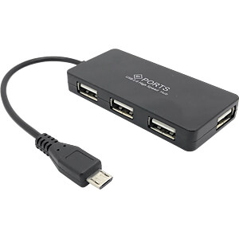
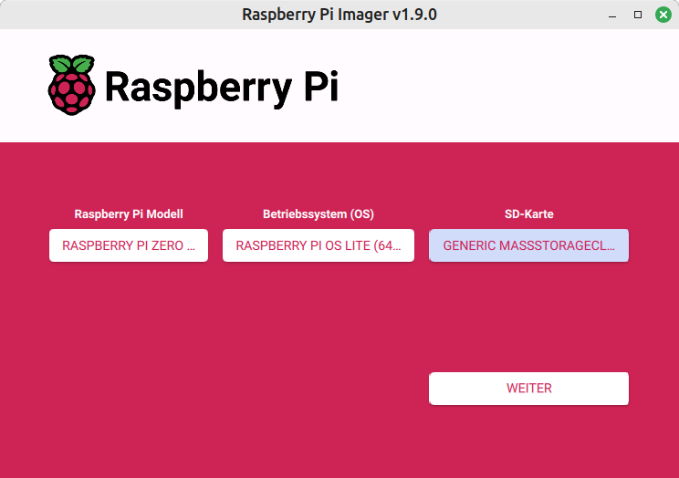
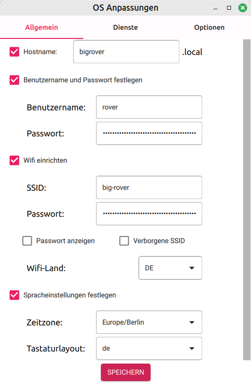

# Raspberry Pi vorbereiten, Projektverzeichnis einbinden.

## Netzwerkumgebung 

Das Projekt kann in unterschiedlichen Netzwerk-Umgebungen und -Konfigurationen 
sinnvoll umgesetzt werden. Der Raspberry Zero2 hat einen WLAN Controller auf dem Board,
der für die Kommunikation mit dem Enntwicklungsrechener genutzt werden soll. 
Dazu wird aber je nach Netzwerk-Umgebung eventuell zusätzliche Hardware benötigt.
Zusätzliche USB Hardware kann über einen Micro-USB-Hub angeschlossen werden.


<!-- p align="left"> 
<br/>µUSB Hub</p -->

### (Scheinbar) einfachster Fall: Entwicklungsrechner und Raspi im gleichen lokalen Netz

Bei der [Installation des Betriebssystems](#betriebssystem-installieren) die
Zugangsdaten für das verwendete WLAN (Netzname, Passwort) eingeben. Prinzipiell
geht es auch, wenn der Raspi in einem anderen erreichbaren Netz eingebunden ist.
Dann kann man ihn etwas umständlicher über seine IP Adresse erreichen.

**Vorteil**<br>
Es kann sofort losgehen mit der Entwicklung

**Nachteil**<br>
Wenn der Rover von einem anderen Rechner außerhalb des lokalen Netzes,
z.B. von einem Handy, gesteuert werden soll, muss ein zusätzlicher WLAN Controller
im Raspi installiert und konfiguriert werden.

### Raspi als lokaler Hotspot

Lässt sich nicht direkt über den Raspberry Pi Imager konfigurieren. 
Daher muss zuerst ein Zugang zu Raspi gefunden werden, über den ein Hotspot 
konfiguriert werden kann.

**Vorteil**<br>
Raspi kann direkt von jedem Rechner, der sich mit dem Hotspot verbindet, 
gesteuert werden.

**Nachteile**
- Der Raspi hat keinen Zugang zum Internet. Wenn Python Module installiert werden
sollen, muss die Konfiguration so geändert werden, dass ein Internetzugang möglich ist.
- Der Entwicklungrechner hat nur Zugang zum Raspi, wenn er sich per WiFi mit dem 
 Raspi Hotspot verbindet.

### Flexibelste Lösung mit zusätzlicher Hardware

Mit einem zusätzlichen Mikro-USB-Hub und ein oder zwei USB Netzwerkadaptern kann
der Raspi sowohl als Hotspot konfiguriert werden als auch über das WLAN
mit dem Internet verbunden sein. Die Verbindung mit dem Entwicklungsrechner kann
entweder über das lokale Netz erfolgen oder über eine direkte Verbindung zu Hotspot.
Für die zweite Lösung braucht es ggf. den zusätzlichen Netzwerkadapter 
im Entwicklungsrechner.

**Vorteil**<br>
Alle Vorteile von oben.

**Nachteil**<br>
Zusätzliche Hardware wird benötigt.

## Betriebssystem installieren

Für die bereitgestellten Raspis im Projekt ist Raspbian bookmark bereits installiert. 

Mit dem [Raspberry Pi Imager](https://www.raspberrypi.com/software/) kann man selber eine passende SD-Karte erstellen:

<p align="left"> 

<br/>Raspberry Pi Imager</p>

Für den Raspi Zero2 eignet sich besonders die RASPBERRY PI OS LITE (64 Bit) Version,
die keine grafische Benutzeroberfläche installiert. Das spart Prozessor Ressourcen. 

Nach dem WEITER Button kann man eine Tabelle öffnen, in der Anpassungen des Betriebssystems
konfiguriert werden können. Alle Anleitungen verwenden den Nutzernamen *rover* und
einen ähnlichen Hostnamen. Bei der WiFi-Einrichtung kann die Verbindung zu einem
lokalen WLAN konfiguriert werden. Eine Hotspot Konfiguration ist hier  nicht möglich.

**Wichtig ist noch, auf dem Tab *Dienste* den ssh-Server zu aktualisieren (keine Abb.).**

<p align="left"> 

<br/>Image anpassen</p>

Das Betriebssystem Image kann jetzt auf eine SD Karte geladen werden. Wenn alles stimmt und
die [Netzwerkumgebung](#netzwerkumgebung-) passt, sollte der Raspi jetzt erstmalig booten und
im lokalen Netz erreichbar sein. Hat der Raspi also den Netzwerknamen
'bigrover', dann sollte er mit 'bigrover.local' erreichbar sein.
Der Befehl 'ping bigrover.local' sollte erfolgreich die Verbindung testen.
Wenn das nicht klappt, notfalls IP-Adresse verwenden.

> Falls alles nicht klappt, geht alternativ ein Zugriff auf das System mit
Bildschirm am Mini-HDMI Ausgang und einer Tastatur am USB Hub. Dann kann man mit dem Befehl
*ifconfig* die eigene IP Adresse auslesen. Falls der ssh server nicht wie oben beschrieben
installiert wurde, lässt sich die Software mit `sudo apt install openssh-server` auf dem
Raspi nachinstallieren.
> Der ssh Server muss außerdem freigegeben sein. Bei der Installation (s.o.) ist das
durch den Haken auf dem Diensta Tab alles geregelt. Sonst kann auf der Kommandozeile
der Befehl <br>`sudo raspi-config`<br>
ausgeführt und bei den `Intertfacing Options` der Punkt `ssh` aktiviert werden.

Hier gibt es auch noch [eine ausführliche Anleitung](https://www.heise.de/tipps-tricks/Raspberry-Pi-SSH-einrichten-so-geht-s-4190645.html#SSH%20auf%20dem%20Raspberry%20Pi%20installieren) 

## Weitere Vorbereitungen 

Wenn alles geklappt hat, kann jetzt mit `ssh rover@bigrover.local` eine Terminalumgebung
auf dem Rover gestartet werden. Die wird zur folgenden Installation verwendet.

### Software für Python-Entwicklung installieren

Unsere Entwicklung verwendet den Package und Dependency Manager *poetry*. 
Den installiert man am besten mit *pipx*.
Und pipx installiert man auf dem Raspi mit
```
sudo apt update
sudo apt install pipx
pipx ensurepath
```
und dann
```
pipx install poetry
```

### Ssh Zugang mit privatem Schlüssel einrichten

Ssh kann einen privaten Schlüssel aus dem Verzeichnis `~/.ssh` verwenden, um die Verbindung 
ohne Passworteingabe aufzubauen. Für den Schlüssel kann mit der Option `-C Schlüsselname` 
ein Name angegeben werden. Wenn die Option `-C` nicht verwendet wird, heißt der Schlüssel
automatisch `id_ed25519`.
```
# Schlüssel auf dem Entwicklungsrechner generieren
ssh-keygen -t ed25519
# Ggf. Dateiname und IP des Zielsystems anpassen
ssh-copy-id -i ./.ssh/id_ed25519 rover@bigrover.local
```
Danach sollte der ssh Zugriff ohne Passworteingabe funktionieren.

## Raspi Dateisystem lokal einbinden

Die nächsten Schritte werden im Terminalfenster auf dem Linux Entwicklungsrechner
durchgeführt. Unter Windows sollte es mit dem 
[Windows Subsystem for Linux (WSL)](https://ubuntu.com/desktop/wsl)
genauso gehen. 
Bis auf Schritt 2 sind sie nur einmalig notwendig. Die Kommandos 

1. Auf dem Entwicklungsrechner das Verzeichnis `~/Development/python/rover` anlegen,
 wenn noch nicht vorhanden:<br/>`mkdir -p ~/Development/python/rover`
2. **Nur dieser Schritt muss zu Beginn jeder Entwicklungs-Session ausgeführt werden!**<br/>
 Mit dem Befehl `sshfs` das Raspi Dateisystem in das Verzeichnis
 `~/Development/python/rover` einbinden:<br/>
 ```
 sshfs rover@bigrover.local:/home/rover/ ~/Development/python/rover \
 -o idmap=user -o uid=$(id -u) -o gid=$(id -g) -o follow_symlinks
 ```
3. Mit dem Befehl `cd ~/Development/python/rover` sind wir jetzt im Raspi Dateisystem. 
 Dort können wir mit `mkdir pydev` das Basisverzeichnis für unsere Python Entwicklung anlegen,
 wenn wir das nicht schon gemacht haben und mit `cd pydev` in dieses Verzeichnis wechseln.

Weiter geht es jetzt mit der [Projekteinrichtung](project-setup.md)
